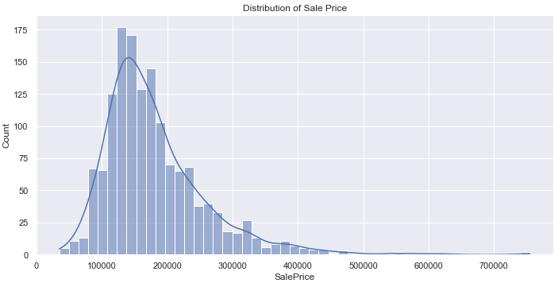
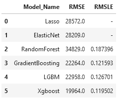

### House Price Prediction

Predicting House Price using Regression Techniques

#

### Notebook

| Notebook | Colab |
| ------ | ------ |
| House Price |  |
| Hyperparameters Tuning |  |

### Insights 

1. Target variable is rightly(+ve) skewed. 
2. Minmum SalePrice of a house is 34900 and 755000 maximum 
3. The oldest house is from year 1872 and the most recent built is from 2010
4. Most houses have Garage attached to home
5. GarageArea, GarageCars, GrLivArea, OverallQual, TotalBsmtSF etc. have the correlation of more than .6 with the target variable.
6. There are multiple reasons for a house to be expensive, and some of them are following:
      1. House is in the Northridge Heights Neighborhood
      2. House is located in Residential Low Density zone
      3. House having kitchen quality Excellent
      4. House just constructed and sold

### Results

### Requirements 

1.scikit-learn
2.xgboost
3.lightgbm
4.optuna
